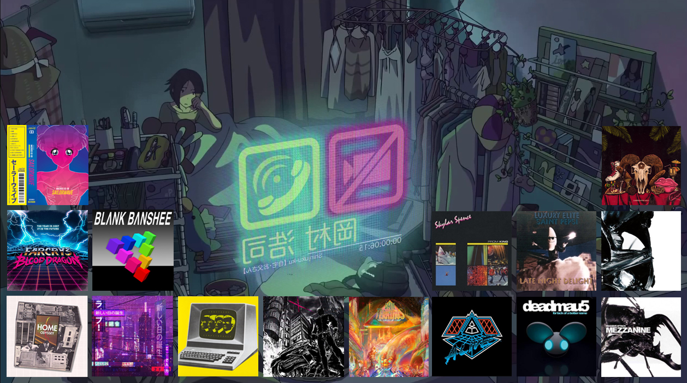

## about me👨‍💻

Frontend Engineer based in Dhaka, Bangladesh. 

<ul>
  <li>🔭 Currently learning data analytics paradigms (Power BI, Matplotlib etc.).
  <li>🌱 Currently learning PHP to improve my backend engineering skills.</li>
  <li>🎸 I love listening to music and playing folk, rock and indie music on my guitar!</li>
  <li>📫 How you can reach me: <a href="mailto:shafin808s@gmail.com">shafin808s@gmail.com</a></li>
  <li>📄 My links: <a href="https://bento.me/shafinrahman">bento.me/shafinrahman</a></li>
</ul>

## frontend stack🌍

  

## ml/data analytics stack🖥️

       

## projects i've worked on💽

<ul>
  <li><a href="https://github.com/shafin-r/ghotona-chitro">Ghotona Chitro</a>, a web application that can detect events from bangla text sources.</li>
  <li><a href="https://github.com/shafin-r/examjam">ExamJam</a>, an educational technology platform for admission students preparing for universities.</li>
</ul>

## my stats📈

